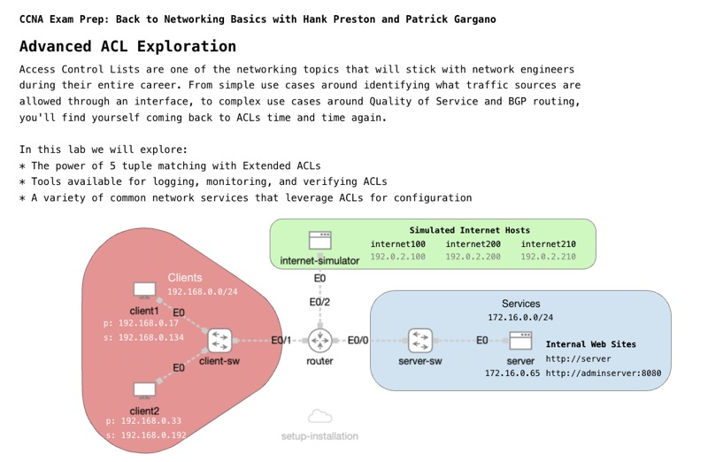

# Advanced ACL Exploration

*Abstract:* There's more to Access Control Lists than just allowing IP traffic into or out from an interface. In this CCNA Prep session, you'll learn the power of 5 tuple matching. Not sure what a 'tuple' is? No problem, we'll explain it to you. You'll also learn where ACLs show up beyond interface access-groups. From device management, NAT, NTP and quality services, ACLs play a pivotal role in an optimized and secure network. Get ready to crush any ACL question on your CCNA exam by joining in.

