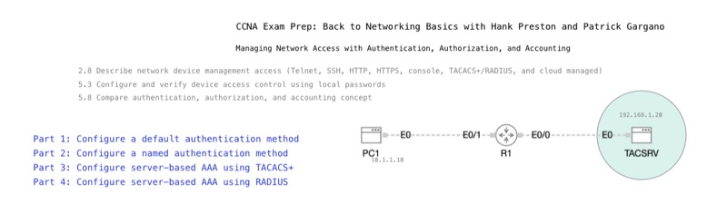

# Managing Network Access with Authentication, Authorization, and Accounting

*Abstract:* An overview of AAA (Authentication, Authorization, and Accounting) is presented as it applies to Cisco networks. Attendees will gain an understanding of how AAA secures access to network devices and resources, the configuration steps using local and external sources, and the role of protocols such as RADIUS and TACACS+. The session concludes with examples of integrating AAA into network management.

