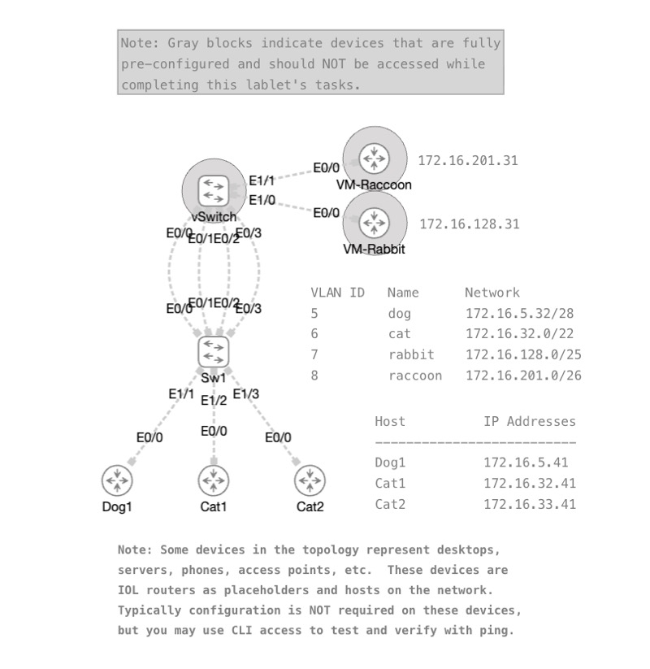

# How to Navigate Practical Exam Tasks - Lablet 3

> This lab requires CML 2.10 or higher.

*Abstract:* Are you nervous about the practical hands-on side of the CCNA exam? This episode is all about exam lablets. We’ll discuss effective time-management strategies, how to interpret complex requirements, and the best habits to build during your practice sessions to ensure you walk into the exam with total confidence.

